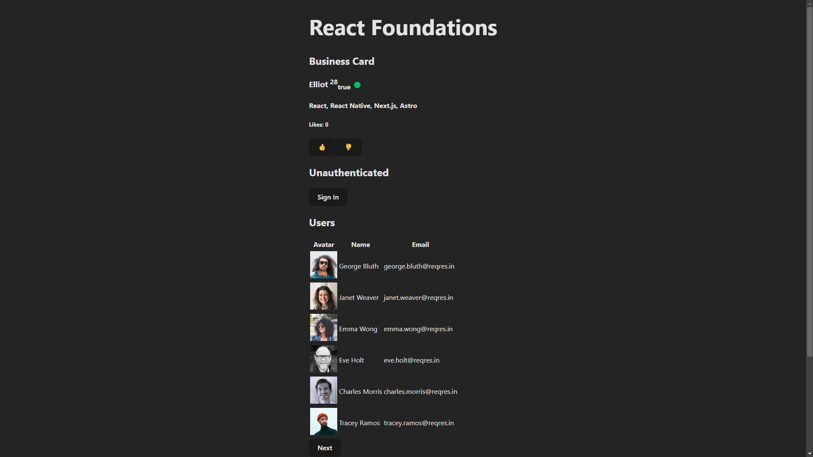
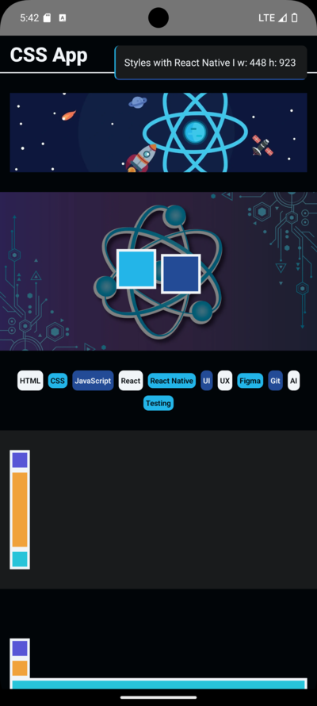

# DevTalles

En este repositorio 👨‍💻 mostraré cómo voy aprendiendo 👨‍🏫 poco a poco de Fernando Herrera en DevTalles 🚀 las tecnologías de mi interés ⚛️ y todo lo relacionado al Frontend. 🌌

## React Native

### [React Foundations](https://github.com/elliotgaramendi/devtalles/tree/develop/react-native/01-react-foundations)

### [Counter App](https://github.com/elliotgaramendi/devtalles/tree/develop/react-native/02-CounterApp)

### [CSS App](https://github.com/elliotgaramendi/devtalles/tree/develop/react-native/03-CSSApp)

### [Calculator](https://github.com/elliotgaramendi/devtalles/tree/develop/react-native/04-Calculator)

