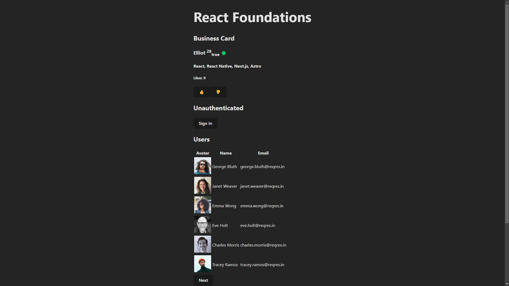
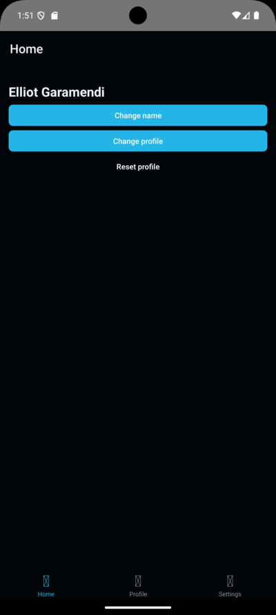

# [DevTalles](https://github.com/elliotgaramendi/devtalles)

En este repositorio 👨‍💻 mostraré cómo voy aprendiendo 👨‍🏫 poco a poco de Fernando Herrera en DevTalles 🚀 las tecnologías de mi interés ⚛️ y todo lo relacionado al Frontend. 🌌

## React Native

### [React Foundations](https://github.com/elliotgaramendi/devtalles/tree/develop/react-native-cli/o1react-foundations)

### [Counter App](https://github.com/elliotgaramendi/devtalles/tree/develop/react-native-cli/o2CounterApp)

### [CSS App](https://github.com/elliotgaramendi/devtalles/tree/develop/react-native-cli/o3CSSApp)

### [Calculator](https://github.com/elliotgaramendi/devtalles/tree/develop/react-native-cli/o4Calculator)

### [Navigation App](https://github.com/elliotgaramendi/devtalles/tree/develop/react-native-cli/o5NavigationApp)

### [Zustand App](https://github.com/elliotgaramendi/devtalles/tree/develop/react-native-cli/o6ZustandApp)

