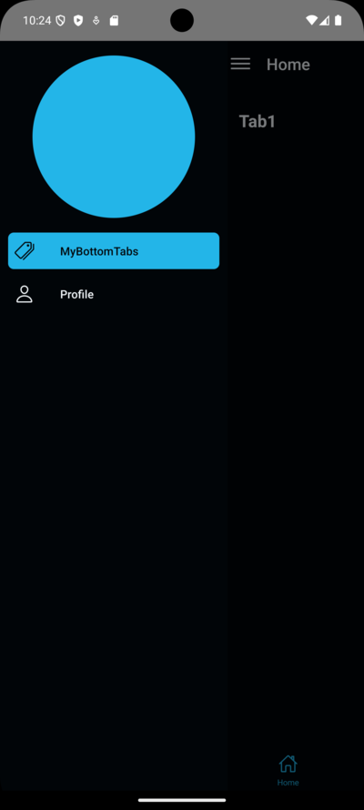

# [DevTalles](https://github.com/elliotgaramendi/devtalles)

En este repositorio 👨‍💻 mostraré cómo voy aprendiendo 👨‍🏫 poco a poco de Fernando Herrera en DevTalles 🚀 las tecnologías de mi interés ⚛️ y todo lo relacionado al Frontend. 🌌

## React Native

### [React Foundations](https://github.com/elliotgaramendi/devtalles/tree/develop/react-native/o1-react-foundations)

### [Counter App](https://github.com/elliotgaramendi/devtalles/tree/develop/react-native/o2-CounterApp)

### [CSS App](https://github.com/elliotgaramendi/devtalles/tree/develop/react-native/o3-CSSApp)

### [Calculator](https://github.com/elliotgaramendi/devtalles/tree/develop/react-native/o4-Calculator)

### [Navigation App](https://github.com/elliotgaramendi/devtalles/tree/develop/react-native/o5-NavigationApp)

### [Zustand App](https://github.com/elliotgaramendi/devtalles/tree/develop/react-native/o6-ZustandApp)

