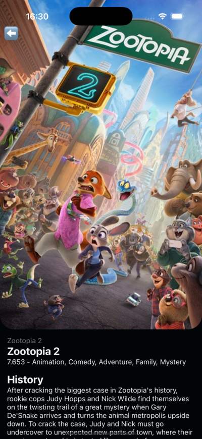

# [🎥 Movies App 🎥](https://github.com/elliotgaramendi/devtalles/tree/develop/react-native-cli/o7MoviesApp)

| 🤖 Android                      | 🍏 iOS                  |
| ------------------------------ | ---------------------- |
|  |  |

## 📜 Descripción 📜
✨ Movies App es una aplicación diseñada para explorar y descubrir películas con información detallada y opciones interactivas. 🚀 Muestra los estrenos más recientes, películas populares y más, utilizando una interfaz amigable y dinámica. 🎬

## 💻 Installation 💻
1. **Clonar el repositorio**
   ```
   git clone https://github.com/elliotgaramendi/devtalles.git
   ```

2. **Ir al directorio raíz del proyecto**
   ```
   cd react-native-cli/o7MoviesApp
   ```

3. **Copiar el archivo `.env.template` y renombrarlo a `.env`**
   ```
   cp .env.template .env
   ```

4. **Editar el archivo `.env` y añadir tu clave de API** (No token, solo clave)
   ```
   BACKEND_API_KEY = {{your_api_key}}
   ```

5. **Instalar dependencias**
   ```
   npm install
   ```

6. **Iniciar la aplicación**
   ```
   npm run start
   ```

### 🍫 Ejecución en Android 🍫
1. Instalar Android Studio.
2. Abrir el proyecto en Android Studio.
3. Ejecutar la aplicación.

### 🍎 Ejecución en iOS 🍎
1. Instalar Xcode.
2. Abrir el proyecto en Xcode.
3. Ejecutar la aplicación.

## 📚 Tecnologías principales 📚
| Tecnología           | Versión | Descripción                                                |
| -------------------- | ------- | ---------------------------------------------------------- |
| **React**            | 18.3.1  | Biblioteca para construir interfaces de usuario.           |
| **React Native**     | 0.76.2  | Framework para desarrollo de aplicaciones móviles nativas. |
| **React Navigation** | ^7.0.2  | Manejo avanzado de navegación para React Native.           |
| **Axios**            | ^1.7.7  | Cliente HTTP para manejar solicitudes a la API.            |

## 📜 Recomendaciones 📜
- 🛠️ **Contribuye al proyecto:** ¡Fork, pull request y colaboración siempre son bienvenidos!
- 🐛 **Reporta problemas:** Si encuentras algún bug, repórtalo en la sección de [Issues](https://github.com/elliotgaramendi/devtalles/issues).

## 🤝 Redes Sociales 🤝
- 📺 [YouTube](https://www.youtube.com/@elliotgaramendi)
- 🐙 [GitHub](https://github.com/elliotgaramendi)
- 💼 [LinkedIn](https://www.linkedin.com/in/elliotgaramendi/)
- 📸 [Instagram](https://www.instagram.com/elliotgaramendi/)

✨ ¡Disfruta de Movies App y lleva tu experiencia cinematográfica al siguiente nivel! ✨
