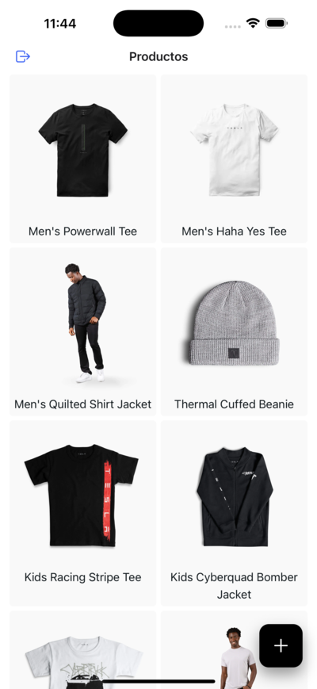

# 🛍️ [Products App](https://github.com/elliotgaramendi/devtalles/tree/develop/react-native-expo/o10-products-app)

A modern **products catalog & management app** built with **React Native + Expo**. Browse products, view details, manage sizes, categories, images, and create or edit items with a clean, production-ready UI. 📦✨

---

## ✨ Features

* 🛒 Product catalog with grid layout
* 🔍 Product detail view with images
* ✏️ Create & edit products
* 📸 Camera & gallery image upload
* 👕 Size selector (XS → XXXL)
* 🧍 Category selector (Men, Women, Kid, Unisex)
* 💾 Secure local storage
* ⚡ State management with Zustand
* 🔄 API-ready data layer
* 📱 Android & iOS support

---

## 📸 Screenshots

| 🤖 Android                      | 🍏 iOS                  |
| ------------------------------ | ---------------------- |
|  |  |

---

## 🚀 Getting Started

1. **Clone the monorepo**

```bash
git clone https://github.com/elliotgaramendi/devtalles
cd react-native-expo/o10-products-app
```

2. **Install dependencies**

```bash
npm install
```

3. **Start the development server**

```bash
npx expo start
```

4. **Run the app**

* 📱 Scan QR with **Expo Go**
* 🍏 Press `i` for iOS simulator
* 🤖 Press `a` for Android emulator

---

## 🛠 Tech Stack

* ⚛️ React Native
* 🚀 Expo
* 🧭 Expo Router
* 🧪 TanStack Query
* 🐻 Zustand
* 📸 Expo Camera & Image Picker
* 🧾 Formik
* 🌐 Axios
* 🟦 TypeScript
* 🎨 Modern UI & UX patterns

---

## 💙 Made by **Elliot Garamendi** with Love and ❤️

Part of the **devtalles** project
**Built with React Native & Expo** 📱🔥
