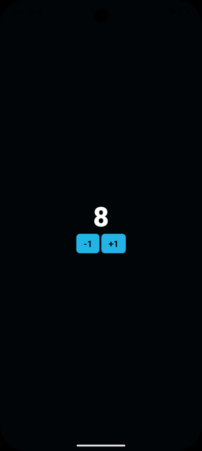
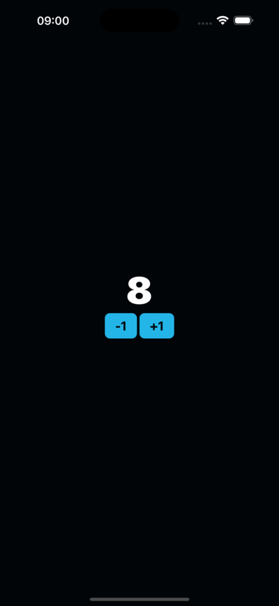

# [🔢 Counter App](https://github.com/elliotgaramendi/devtalles/tree/develop/react-native-expo/o3-counter-app)

A sleek and interactive **counter application** built with **React Native** and **Expo** ⚡️. This app demonstrates fundamental mobile development concepts including state management, component architecture, and cross-platform design patterns. Features a beautiful dark theme with smooth animations and intuitive user interactions - perfect for learning modern mobile development! 🚀✨

## ✨ Features

- 🔢 **Interactive Counter**: Smooth increment and decrement functionality
- 📱 **Cross-Platform**: Seamless experience on both iOS and Android
- 🎨 **Modern Dark UI**: Professional dark theme with cyan accent colors
- 👆 **Smart Interactions**: Single tap to change, long press to reset
- ⚡ **Reusable Components**: Custom Button component with TypeScript
- 🌟 **Smooth Animations**: Beautiful press effects and shadow feedback
- 🎯 **Responsive Design**: Adapts perfectly to different screen sizes

## 📸 Screenshots

| 🤖 Android                                 | 🍏 iOS                             |
| ----------------------------------------- | --------------------------------- |
|  |  |

## 🚀 Getting Started

```bash
# Clone the repository and navigate to the project
git clone https://github.com/elliotgaramendi/devtalles.git
cd devtalles/react-native-expo/o3-counter-app

# Install dependencies
npm install

# Start the development server
npx expo start
```

**Run on your device:**
- 📱 Scan QR code with **Expo Go** app
- 🖥️ Press `i` for **iOS simulator**  
- 🤖 Press `a` for **Android emulator**

## 🛠️ Tech Stack

- ⚛️ **React Native**: Cross-platform mobile framework
- 🎉 **Expo**: Development platform and build service
- 📘 **TypeScript**: Type-safe JavaScript development
- 🎨 **StyleSheet**: Native styling with custom themes
- 🔧 **React Hooks**: Modern state management with useState

## 🎨 Design Features

- 🌑 **Dark Theme**: Professional background (#010508)
- 💙 **Accent Colors**: Beautiful cyan blue (#23b5e8)
- ✨ **Interactive Feedback**: Button animations and shadow effects
- 🔤 **Typography**: Clean font hierarchy with multiple weights
- 📐 **Flexible Layouts**: Responsive design patterns

## 🤝 Contributing

Contributions are welcome! 🎉 Feel free to open issues or submit pull requests to help improve this project.

1. Fork the repository 🍴
2. Create your feature branch 🌿  
3. Commit your changes 💾
4. Push to the branch 🚀
5. Open a Pull Request 📮

## Connect — Socials 🤝🌐
- 📺 YouTube: https://www.youtube.com/@elliotgaramendi
- 🐙 GitHub: https://github.com/elliotgaramendi
- 💼 LinkedIn: https://www.linkedin.com/in/elliotgaramendi/
- 📸 Instagram: https://www.instagram.com/elliotgaramendi/

## 📄 License

This project is open source and available under the MIT License.

---

**Made with ♥️ by Elliot Garamendi with React Native**