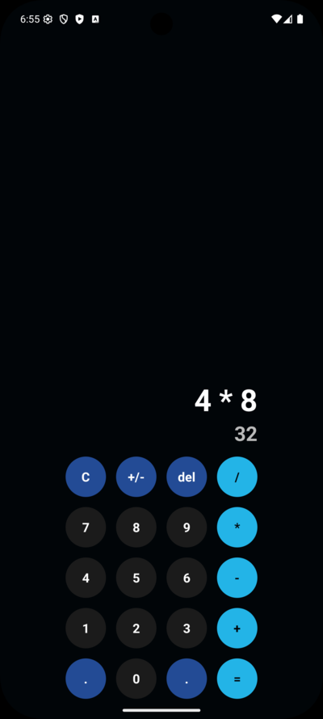
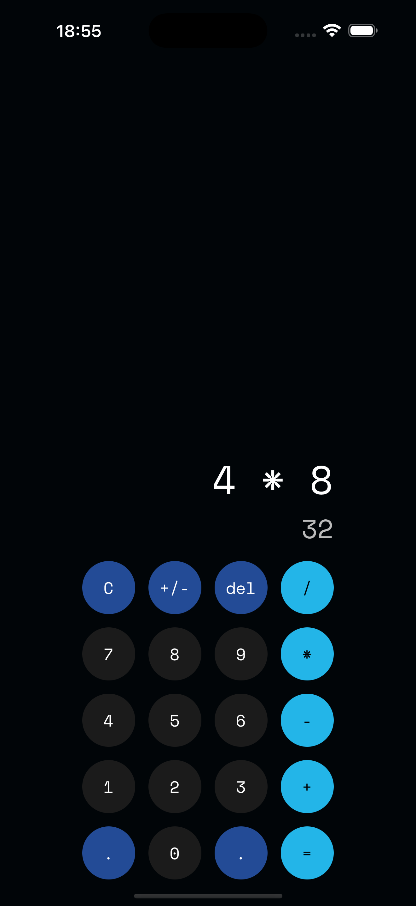

# [🧮 Calculator App](https://github.com/elliotgaramendi/devtalles/tree/develop/react-native-expo/o4-calculator)

A modern and interactive **calculator application** built with **React Native** and **Expo** ⚡️.  
This app demonstrates advanced state management with custom hooks, reusable components, and responsive UI design.  
Features include smooth haptic feedback, dynamic updates, and a clean professional dark theme — perfect for exploring modern mobile development! 🚀✨

## ✨ Features

- 🧮 **Fully Functional Calculator**: Supports addition, subtraction, multiplication, and division
- 🔄 **Live Formula & Result Preview**: Displays operations dynamically while typing
- 📱 **Cross-Platform**: Works seamlessly on both iOS and Android
- 🎨 **Modern Dark UI**: Professional theme with styled buttons and typography
- 👆 **Smart Interactions**: Tap for input, long press support, and haptic feedback
- ⚡ **Reusable Components**: Custom `AppButton` with multiple styles
- 🎯 **Responsive Design**: Adapts perfectly to different screen sizes

## 📸 Screenshots

| 🤖 Android                                 | 🍏 iOS                             |
| ----------------------------------------- | --------------------------------- |
|  |  |

## 🚀 Getting Started

```bash
# Clone the repository and navigate to the project
git clone https://github.com/elliotgaramendi/devtalles.git
cd devtalles/react-native-expo/o4-calculator

# Install dependencies
npm install

# Start the development server
npx expo start
```

**Run on your device:**

* 📱 Scan QR code with **Expo Go** app
* 🖥️ Press `i` for **iOS simulator**
* 🤖 Press `a` for **Android emulator**

## 🛠️ Tech Stack

* ⚛️ **React Native**: Cross-platform mobile framework
* 🎉 **Expo**: Development platform and build service
* 📘 **TypeScript**: Type-safe JavaScript development
* 🎨 **StyleSheet**: Modular and reusable styling system
* 🔧 **Custom Hook (`useCalculator`)**: Encapsulated state and logic for calculator operations
* 📳 **Expo Haptics**: Vibration and feedback on interactions

## 🎨 Design Features

* 🌑 **Dark Theme**: Clean professional look with primary background
* 💙 **Accent Colors**: Styled buttons with visual hierarchy
* ✨ **Interactive Feedback**: Haptic vibrations and press effects
* 🔤 **Custom Fonts**: SpaceMono for clean and modern typography
* 📐 **Flexible Layouts**: Grid-based calculator interface

## 🤝 Contributing

Contributions are welcome! 🎉 Feel free to open issues or submit pull requests to help improve this project.

1. Fork the repository 🍴
2. Create your feature branch 🌿
3. Commit your changes 💾
4. Push to the branch 🚀
5. Open a Pull Request 📮

## Connect — Socials 🤝🌐

* 📺 YouTube: [https://www.youtube.com/@elliotgaramendi](https://www.youtube.com/@elliotgaramendi)
* 🐙 GitHub: [https://github.com/elliotgaramendi](https://github.com/elliotgaramendi)
* 💼 LinkedIn: [https://www.linkedin.com/in/elliotgaramendi/](https://www.linkedin.com/in/elliotgaramendi/)
* 📸 Instagram: [https://www.instagram.com/elliotgaramendi/](https://www.instagram.com/elliotgaramendi/)

## 📄 License

This project is open source and available under the MIT License.

---

**Made with ♥️ by Elliot Garamendi with React Native**
