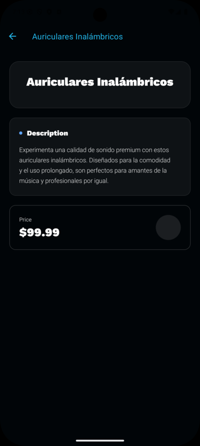
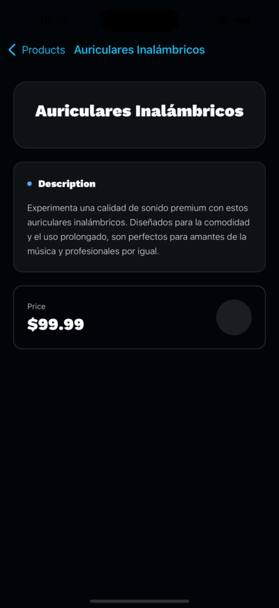

# [🧭 Navigation App](https://github.com/elliotgaramendi/devtalles/tree/develop/react-native-expo/o5-navigation-app)

An elegant and interactive **navigation application** built with **React Native**, **Expo**, and **Expo Router** ⚡️.
This app demonstrates professional navigation patterns including **stack navigation**, **dynamic routing**, and **parameterized screens**.
Features include custom typography, gradient backgrounds, and reusable UI components — perfect for learning advanced navigation in modern mobile development! 🚀✨

## ✨ Features

- 🧭 **Stack Navigation**: Navigate seamlessly across screens (`Home`, `Products`, `Profile`, `Settings`)
- 📦 **Dynamic Routes**: Product details with **ID-based navigation**
- 📱 **Cross-Platform**: Fully compatible with iOS and Android
- 🎨 **Modern UI**: Gradient backgrounds, glassmorphism, and custom typography
- 👆 **Interactive Buttons**: Navigate with tap gestures using `AppButton`
- ⚡ **Reusable Components**: Shared UI with consistent design
- 🎯 **Responsive Layouts**: Tailwind-like utility classes with `nativewind`

## 📸 Screenshots

| 🤖 Android                                 | 🍏 iOS                             |
| ----------------------------------------- | --------------------------------- |
|  |  |

## 🚀 Getting Started

```bash
# Clone the repository and navigate to the project
git clone https://github.com/elliotgaramendi/devtalles.git
cd devtalles/react-native-expo/o5-navigation-app

# Install dependencies
npm install

# Start the development server
npx expo start
````

**Run on your device:**

* 📱 Scan QR code with **Expo Go** app
* 🖥️ Press `i` for **iOS simulator**
* 🤖 Press `a` for **Android emulator**

## 🛠️ Tech Stack

* ⚛️ **React Native**: Cross-platform mobile framework
* 🎉 **Expo**: Development platform and build service
* 🗺️ **Expo Router**: File-based navigation system
* 📘 **TypeScript**: Strongly typed JavaScript
* 🎨 **NativeWind (Tailwind CSS)**: Utility-first styling in React Native
* 🔧 **Custom Fonts**: WorkSans family for modern typography

## 🎨 Design Features

* 🌑 **Dark Theme**: Elegant background with gradients
* 🟣 **Glassmorphism Cards**: Semi-transparent panels with blur effects
* ✨ **Dynamic Headers**: Contextual titles for each screen
* 🔤 **Custom Typography**: WorkSans font family integration
* 📐 **Flexible Layouts**: Utility classes for responsive design

## 🗺️ Navigation Structure

* **Home** → Main menu with navigation buttons
* **Products** → Product list with FlatList
* **Product Details** → Dynamic route: `/products/[id]`
* **Profile** → User profile screen
* **Settings** → Settings management

## 🤝 Contributing

Contributions are welcome! 🎉 Feel free to open issues or submit pull requests to help improve this project.

1. Fork the repository 🍴
2. Create your feature branch 🌿
3. Commit your changes 💾
4. Push to the branch 🚀
5. Open a Pull Request 📮

## Connect — Socials 🤝🌐

* 📺 YouTube: [https://www.youtube.com/@elliotgaramendi](https://www.youtube.com/@elliotgaramendi)
* 🐙 GitHub: [https://github.com/elliotgaramendi](https://github.com/elliotgaramendi)
* 💼 LinkedIn: [https://www.linkedin.com/in/elliotgaramendi/](https://www.linkedin.com/in/elliotgaramendi/)
* 📸 Instagram: [https://www.instagram.com/elliotgaramendi/](https://www.instagram.com/elliotgaramendi/)

## 📄 License

This project is open source and available under the MIT License.

---

**Made with ♥️ by Elliot Garamendi with React Native**
