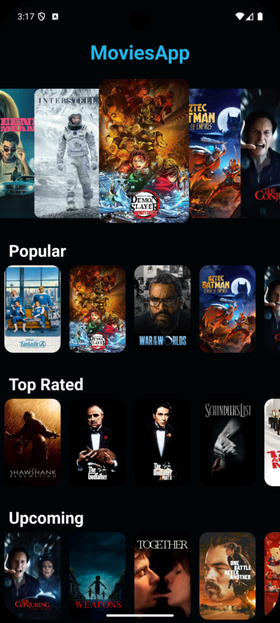
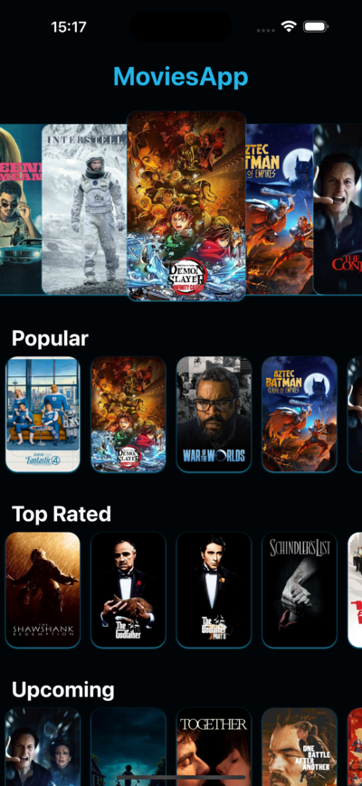

# 🎬[ Movies App](https://github.com/elliotgaramendi/devtalles/tree/develop/react-native-expo/o6-movies-app)

A modern and sleek **movie discovery application** built with **React Native** and **Expo** ⚡️.  
This app features an elegant dark theme, smooth carousel navigation, and comprehensive movie details with cast information.  
Perfect for movie enthusiasts who want to discover and explore the latest films! 🍿✨

## ✨ Features

- 🎬 **Movie Discovery**: Browse now playing, popular, top rated, and upcoming movies
- 🎠 **Interactive Carousel**: Beautiful main slideshow with parallax effects
- 📱 **Cross-Platform**: Works seamlessly on both iOS and Android
- 🎨 **Modern Dark UI**: Professional dark theme with custom styling
- 👆 **Smooth Navigation**: Tab and drawer navigation with custom icons
- ⚡ **Infinite Scroll**: Load more movies as you scroll horizontally
- 🎭 **Movie Details**: Complete movie information with cast and crew
- 🔄 **Smart Caching**: Powered by TanStack Query for optimized data fetching

## 📸 Screenshots

| 🤖 Android                                 | 🍏 iOS                             |
| ----------------------------------------- | --------------------------------- |
|  |  |


## 🚀 Getting Started

1. **Clone the repository:**
```bash
git clone <your-repo-url>
cd movies-app
```

2. **Install dependencies:**
```bash
npm install
```

3. **Set up environment variables:**
```bash
cp .env.example .env
```

4. **Add your Movie Database API credentials to `.env`:**
```env
EXPO_PUBLIC_BASE_API_URL=https://api.themoviedb.org/3
EXPO_PUBLIC_API_KEY=your_api_key_here
```
Get your API key from [The Movie Database](https://www.themoviedb.org/settings/api).

5. **Start the development server:**
```bash
npx expo start
```

**Run on your device:**

* 📱 Scan QR code with **Expo Go** app
* 🖥️ Press `i` for **iOS simulator**
* 🤖 Press `a` for **Android emulator**

## 🛠️ Tech Stack

* ⚛️ **React Native**: Cross-platform mobile framework
* 🎉 **Expo**: Development platform and routing
* 📘 **TypeScript**: Type-safe development
* 🎨 **NativeWind**: Tailwind CSS for React Native
* 🔄 **TanStack Query**: Data fetching and caching
* 🎠 **React Native Reanimated Carousel**: Smooth carousel components
* 🎭 **The Movie Database API**: Movie data source
* 🧭 **Expo Router**: File-based navigation system

## 🎯 Key Components

* **MainSlideshow**: Interactive movie carousel with parallax effects
* **MovieHorizontalList**: Horizontal scrolling movie lists with infinite scroll
* **MovieHeader**: Detailed movie poster and title display
* **MovieCast**: Actor information with profile images
* **Custom Navigation**: Tab and drawer layouts with dark theme

## 🤝 Contributing

Contributions are welcome! 🎉 Feel free to open issues or submit pull requests.

1. Fork the repository 🍴
2. Create your feature branch 🌿
3. Commit your changes 💾
4. Push to the branch 🚀
5. Open a Pull Request 📮

## 📄 License

This project is open source and available under the MIT License.

---

**Made with ♥️ using React Native and Expo**