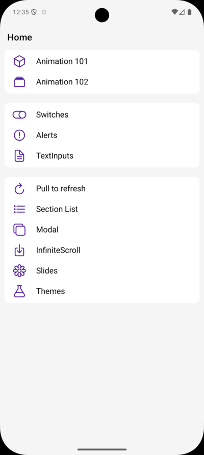
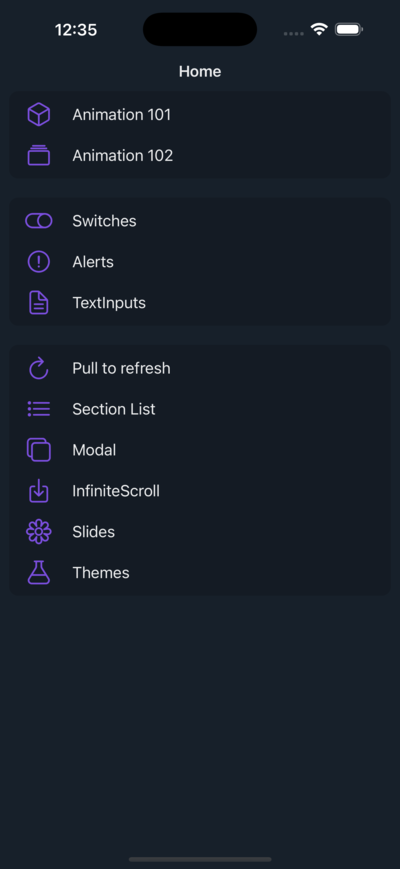

# 🎨 [Components App](https://github.com/elliotgaramendi/devtalles/tree/develop/react-native-expo/o7-components-app)

A modern and sleek **UI components playground** built with **React Native**, **Expo**, and **Expo Router** ⚡️.
This app serves as a **comprehensive demo of reusable UI elements**, interactive layouts, system components, animations, and themed widgets.
Perfect for developers who want to explore, learn, and build beautiful interfaces in React Native! ✨📱

## ✨ Features

* 🎛️ **UI Showcase**: Explore dozens of ready-to-use components (inputs, switches, buttons, cards, alerts, and more)
* 🧭 **File-Based Navigation**: Clean Expo Router structure for all demo screens
* 🎨 **Theming Engine**: Light and dark modes powered by a custom theme context
* 🌀 **Animations**: Smooth examples including fade-in images and Reanimated-based effects
* 🔄 **Pull to Refresh**: Native refresh control demonstration
* 📜 **Section List Demo**: Grouped lists with headers and themed styling
* 🪄 **Modals**: Multiple modal window examples using Expo Router modals
* 🎠 **Slides Showcase**: Onboarding-like carousel with custom images
* 📱 **Cross-Platform**: Works flawlessly on Android, iOS, and Web (via Expo)
* ⚡ **Responsive Styling**: Built with NativeWind (Tailwind) for scalable UI

## 📸 Screenshots

| 🤖 Android                                 | 🍏 iOS                             |
| ----------------------------------------- | --------------------------------- |
|  |  |

---

## 🚀 Getting Started

1. **Clone the repository:**

```bash
git clone <your-repo-url>
cd /devtalles/react-native-expo/o7-components-app
```

2. **Install dependencies:**

```bash
npm install
```

3. **Start the development server:**

```bash
npx expo start
```

**Run on your device:**

* 📱 Scan QR code with **Expo Go**
* 🖥️ Press `i` to launch **iOS simulator**
* 🤖 Press `a` to launch **Android emulator**

---

## 🛠️ Tech Stack

* ⚛️ **React Native** – Cross-platform framework
* 🎉 **Expo** – Development platform, routing, and build tools
* 🗺️ **Expo Router** – File-based navigation system
* 📘 **TypeScript** – Fully typed components
* 🎨 **NativeWind** – Tailwind for React Native
* 🎭 **Expo Image** – Fast and optimized image rendering
* 🎞️ **React Native Reanimated** – Animations and gestures
* 💾 **Async Storage** – Persistent storage for themes/settings
* 🧩 **Expo Haptics** – Vibration feedback for supported components

---

## 🎯 Key Components & Screens

Your app includes a rich set of modular UI demos:

### 📦 **UI Components**

* **ThemedText** – Dynamic typography with theme support
* **ThemedCard** – Beautiful card containers
* **ThemedButton** – Styled and responsive button
* **ThemedSwitch** – Toggle component with animations
* **ThemedView** – Adaptive wrapper for backgrounds
* **ThemedTextInput** – Customizable input fields

### 🧭 **Screens / Examples**

* ⚠️ **Alerts** – Interactive alert examples
* 🎞️ **Animation 101 & 102** – Basics of animations and transitions
* 🌀 **Infinite Scroll** – Paginated loading list
* 💬 **Modals** – Native and custom modal screens
* 🔄 **Pull to Refresh** – RefreshControl demo
* 📚 **Section List** – Grouped list UI
* 🎠 **Slides** – Onboarding carousel with images
* 🔤 **Text Inputs** – Custom form fields
* 🎨 **Themes** – Light/Dark theme switcher

Each folder in `/app` corresponds to a live example screen.

---

## 🤝 Contributing

Contributions are welcome! 🎉 Submit issues or PRs to improve the component collection.

1. Fork the repository 🍴
2. Create a new feature branch 🌿
3. Commit your changes 💾
4. Push your branch 🚀
5. Open a Pull Request 📮

---

## 📄 License

This project is open source under the MIT License.

---

**Made with ♥️ using React Native and Expo**
