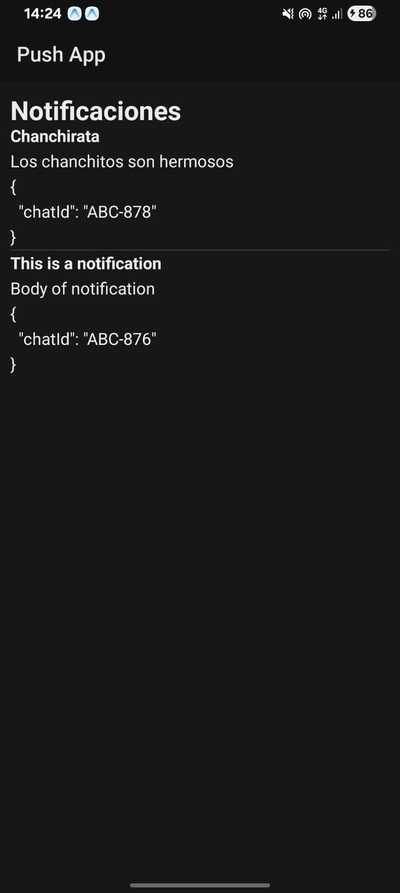

# 🎨 [Push Notifications App](https://github.com/elliotgaramendi/devtalles/tree/develop/react-native-expo/o8-push-app)

A lightweight and focused **push notifications demo** built with **React Native**, **Expo**, and **Expo Router** ⚡️.
This app showcases **how to receive push notifications**, display them in real time, and **navigate to dynamic routes** when a notification is tapped. ✨📱

## ✨ Features

* 🔔 **Real-Time Notifications**: Receive push notifications and display them instantly in a list
* 📡 **Push Token Registration**: Automatically fetches and logs the Expo Push Token
* 📨 **Notification Listener**: Handles foreground notifications and updates the UI
* 🚀 **Navigation via Push**: Tapping a notification opens `/chat/[id]` using Expo Router
* 📱 **Dynamic Routing**: Chat screen auto-reads `chatId` from notification payload
* 🧭 **File-Based Navigation**: Simple and clean routing with Expo Router
* 🌗 **Themed Components**: Uses ThemedView and ThemedText for consistent UI styling
* ⚡ **Minimal & Practical**: Only the essential logic—ideal for learning or reuse

## 📸 Screenshots

| 🤖 Android                                  |
| ------------------------------------------ |
|  |

---

## 🚀 Getting Started

1. **Clone the repository:**

```bash
git clone <your-repo-url>
cd /devtalles/react-native-expo/o8-push-app
```

2. **Install dependencies:**

```bash
npm install
```

3. **Start the development server:**

```bash
npx expo start
```

**Run on your device:**

* 📱 Requires a **physical device** (Expo Push Notifications do not work on simulators)
* Scan QR code with **Expo Go**

---

## 🛠️ Tech Stack

* ⚛️ **React Native** – Cross-platform framework
* 🎉 **Expo** – Push Notifications API + development tools
* 🗺️ **Expo Router** – File-based navigation system
* 📘 **TypeScript** – Full type-safety
* 🔔 **Expo Notifications** – Push token, listeners, handlers
* 🎨 **Themed Components** – Reusable UI using ThemedText & ThemedView
* 📡 **Fetch API** – Sends push messages to Expo’s push service

---

## 🎯 Key Components & Screens

Your app includes the essential building blocks for push workflows:

### 🔔 **Push Logic (Hook)**

* **usePushNotifications**

  * Registers device for notifications
  * Retrieves Expo Push Token
  * Listens for incoming notifications
  * Handles tap events and redirects to `/chat/[id]`
  * Exposes `sendPushNotification()` helper

### 📨 **Screens / Examples**

* **Home (`/`)** – Lists all received notifications in real time
* **Chat ID (`/chat/[id]`)** – Opens automatically when user taps a push notification
* **Push Token Logging** – Useful for testing via Expo Push Tool

Each folder in `/app` maps directly to a functional screen.

---

## 🤝 Contributing

Contributions are welcome! 🎉 Submit issues or PRs to improve the push workflow or documentation.

1. Fork the repository 🍴
2. Create a new feature branch 🌿
3. Commit your changes 💾
4. Push your branch 🚀
5. Open a Pull Request 📮

---

## 📄 License

This project is open source under the MIT License.

---

**Made with ♥️ using React Native, Expo, and Push Notifications**
