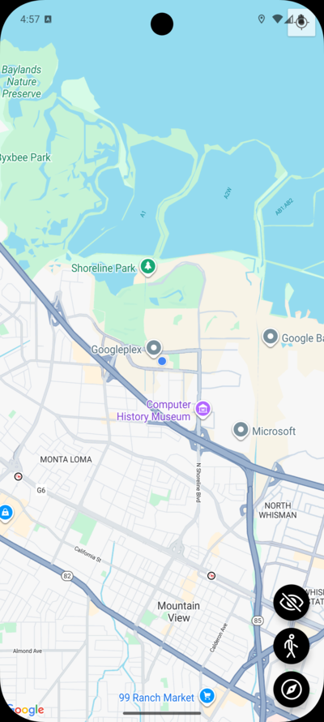
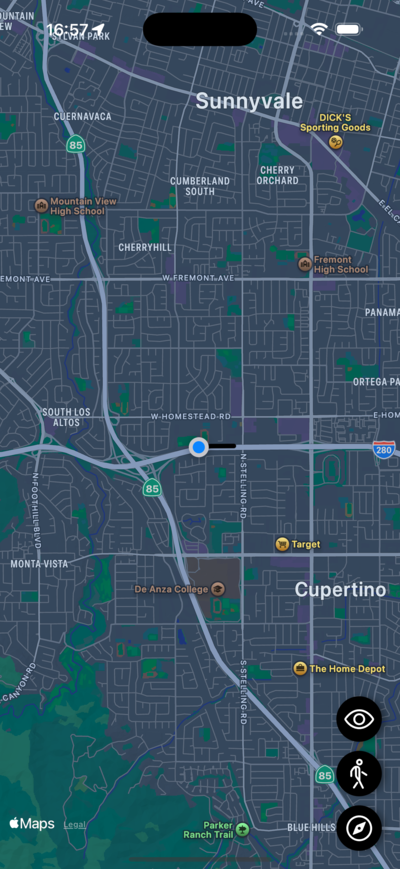

# 🗺️ [Maps App](https://github.com/elliotgaramendi/devtalles/tree/develop/react-native-expo/o9-maps-app)

A modern and interactive **maps demo application** built with **React Native** and **Expo**. Explore coordinates, user location, map markers, region updates, and real-time map interactions. Perfect for learning geolocation in mobile apps. ⚡📍

---

## ✨ Features

* 📍 Live user location tracking
* 🗺️ Interactive map with zoom & pan
* 🛰️ Watch position updates
* 🔄 Real-time location subscription
* 🚀 Expo Go ready for instant testing

---

## 📸 Screenshots

| 🤖 Android                      | 🍏 iOS                  |
| ------------------------------ | ---------------------- |
|  |  |

---

## 🚀 Getting Started

1. **Clone the project**

```bash
git clone https://github.com/elliotgaramendi/devtalles
cd react-native-expo/o9-maps-app
```

2. **Install dependencies**

```bash
npm install
```

3. **Start development server**

```bash
npx expo start
```

4. **Run on your device**

* 📱 Scan QR with **Expo Go**
* 🍏 Press `i` to open iOS simulator
* 🤖 Press `a` to open Android emulator

---

## 🛠 Tech Stack

* ⚛️ React Native
* 🚀 Expo
* 🗺️ React Native Maps
* 🎨 NativeWind (Tailwind)
* 📦 TypeScript
* 🌍 Expo Location API
* 📡 Real-time geolocation events

---

## 🧡 Made with love by **Elliot Garamendi**

Crafting beautiful, modern and educational mobile apps. 🚀📱✨
