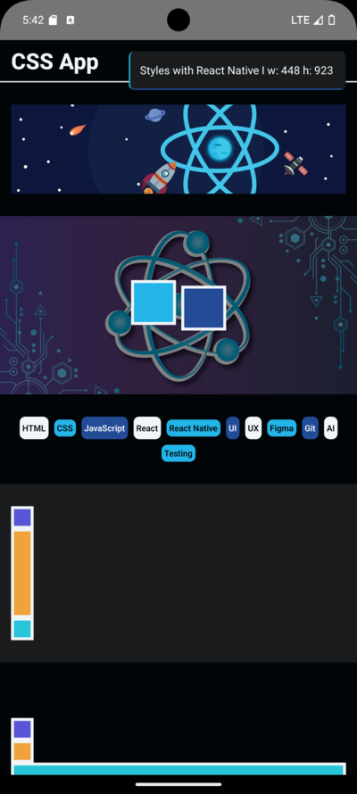

# [CSS App](https://github.com/elliotgaramendi/devtalles/tree/develop/react-native/03-CSSApp)

## 📜 Descripción 📜

👨‍💻 Aprendizaje de estilos en React Native usando Stylesheets para lograr diseños funcionales. 👨‍💻

## 📚 Tecnologías principales 📚

| Tecnología   | Versión | Descripción                                               |
| ------------ | ------- | --------------------------------------------------------- |
| react        | 18.2.0  | Biblioteca para construir interfaces de usuario           |
| react-native | 0.74.3  | Framework para desarrollo de aplicaciones móviles nativas |

## 🤗 Redes sociales 🤗

- 🐭 YouTube: https://www.youtube.com/@elliotgaramendi 🐭
- 🐭 GitHub: https://github.com/elliotgaramendi 🐭
- 🐭 LinkedIn: https://www.linkedin.com/in/elliotgaramendi/ 🐭
- 🐭 Instagram: https://www.instagram.com/elliotgaramendi/ 🐭
