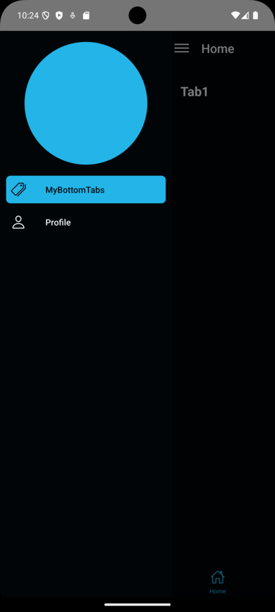

# [Navigation App](https://github.com/elliotgaramendi/devtalles/tree/develop/react-native/05-NavigationApp)

## 📜 Descripción 📜

👨‍💻 Exploración de React Navigation para crear una navegación fluida en aplicaciones móviles con Tabs, Drawers y Stacks. 👨‍💻

## 📚 Tecnologías principales 📚

| Tecnología                            | Versión | Descripción                                               |
| ------------------------------------- | ------- | --------------------------------------------------------- |
| react                                 | 18.2.0  | Biblioteca para construir interfaces de usuario           |
| react-native                          | 0.74.3  | Framework para desarrollo de aplicaciones móviles nativas |
| @react-native-masked-view/masked-view | ^0.3.1  | Biblioteca para enmascarar vistas en aplicaciones móviles |
| @react-navigation/bottom-tabs         | ^6.6.1  | Navegación por pestañas en la parte inferior              |
| @react-navigation/drawer              | ^6.7.2  | Navegación con paneles laterales                          |
| @react-navigation/material-top-tabs   | ^6.6.14 | Navegación con pestañas en la parte superior              |
| @react-navigation/native              | ^6.1.18 | Navegación y enrutamiento para aplicaciones React Native  |
| @react-navigation/stack               | ^6.4.1  | Navegación por pila en aplicaciones móviles               |
| react-native-gesture-handler          | ^2.17.1 | Manejo de gestos en React Native                          |
| react-native-pager-view               | ^6.3.3  | Componente para paginación en React Native                |
| react-native-reanimated               | ^3.14.0 | Animaciones en React Native                               |
| react-native-safe-area-context        | ^4.10.8 | Manejo de áreas seguras en aplicaciones móviles           |
| react-native-screens                  | ^3.32.0 | Manejo de pantallas en React Native                       |
| react-native-tab-view                 | ^3.5.2  | Navegación por pestañas en React Native                   |
| react-native-vector-icons             | ^10.1.0 | Iconos vectoriales para React Native                      |

## 🤗 Redes sociales 🤗

- 🐭 YouTube: https://www.youtube.com/@elliotgaramendi 🐭
- 🐭 GitHub: https://github.com/elliotgaramendi 🐭
- 🐭 LinkedIn: https://www.linkedin.com/in/elliotgaramendi/ 🐭
- 🐭 Instagram: https://www.instagram.com/elliotgaramendi/ 🐭
