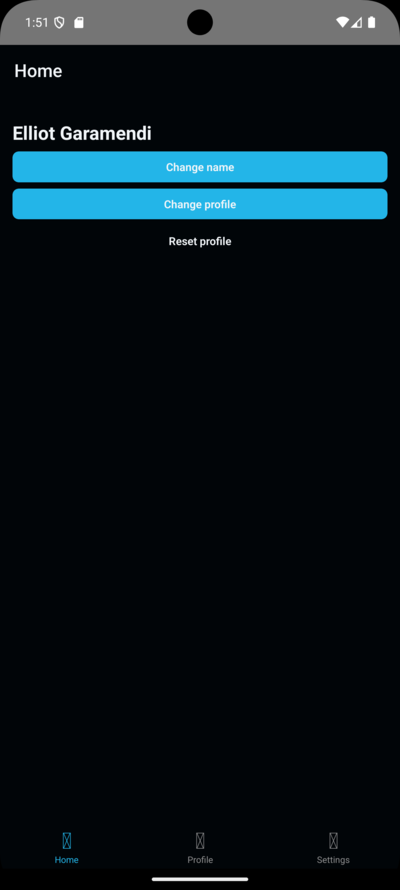

# [Zustand App](https://github.com/elliotgaramendi/devtalles/tree/develop/react-native/06-ZustandApp)

## 📜 Descripción 📜

👨‍💻 Gestión de estado con Zustand y navegación persistente en React Native usando React Navigation para una experiencia fluida. 👨‍💻

## 📚 Tecnologías principales 📚

| Tecnología                     | Versión | Descripción                                               |
| ------------------------------ | ------- | --------------------------------------------------------- |
| @react-navigation/bottom-tabs  | ^6.6.1  | Navegación por pestañas en la parte inferior              |
| @react-navigation/native       | ^6.1.18 | Navegación y enrutamiento para aplicaciones React Native  |
| react                          | 18.2.0  | Biblioteca para construir interfaces de usuario           |
| react-native                   | 0.74.3  | Framework para desarrollo de aplicaciones móviles nativas |
| react-native-safe-area-context | ^4.10.8 | Manejo de áreas seguras en aplicaciones móviles           |
| react-native-screens           | ^3.32.0 | Manejo de pantallas en React Native                       |
| zustand                        | ^4.5.4  | Manejo de estado global en aplicaciones React             |

## 🤗 Redes sociales 🤗

- 🐭 YouTube: https://www.youtube.com/@elliotgaramendi 🐭
- 🐭 GitHub: https://github.com/elliotgaramendi 🐭
- 🐭 LinkedIn: https://www.linkedin.com/in/elliotgaramendi/ 🐭
- 🐭 Instagram: https://www.instagram.com/elliotgaramendi/ 🐭
